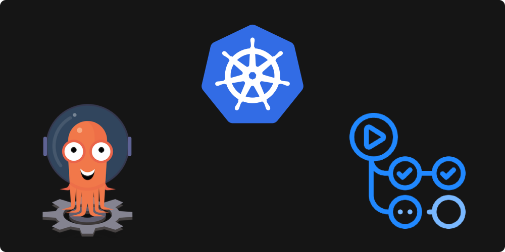
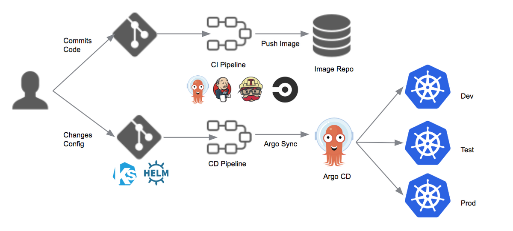
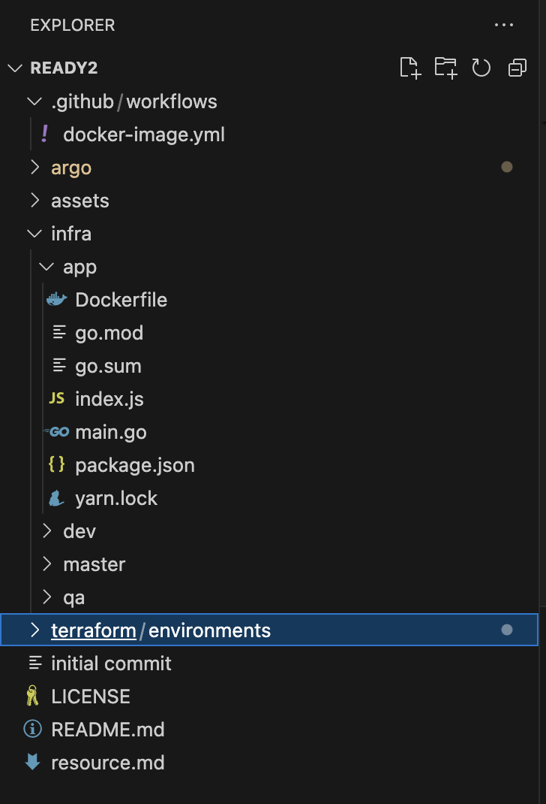
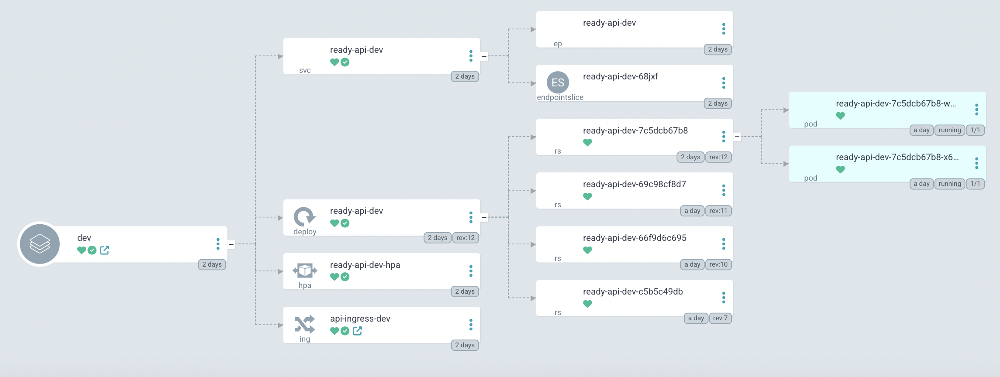
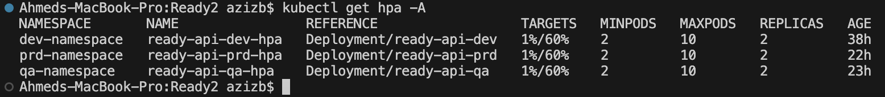
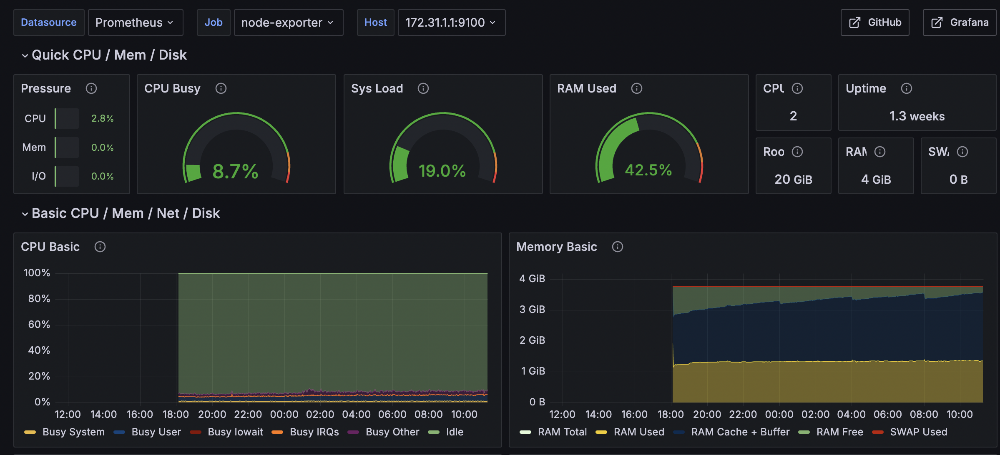

# Ready Api design, CI/CD With ArgoCD, Github Actions on Kubernetes



This project uses the following tools:

- [Kubernetes](#Kubernetes)
- [ArgoCD](#ArgoCD)
- [GithubActions](#GithubActions)
- [Terraform](#Terraform)


### Content
- [Useful Links](#useful-links)
- [Introduction](#Introduction)
  - [Kubernetes](#Kubernetes)
  - [ArgoCD](#ArgoCD)
  - [GithubActions](#GithubActions)
  - [Terraform](#Terraform)
- [Configurations](#Configurations)
  - [Step 1: Deploying an AWS cluster (HPA enabled) with Prometheus & Grafana for monitoring](#Step-1-Deploying-an-AWS-cluster-(HPA-enabled)-with-Prometheus-&-Grafana-for-monitoring)
  - [Step 2: Structuring the Repo and CI/CD Pipelines](#Step-2-Structuring-the-Repo-and-CI/CD-Pipelines)
  - [Step 3: Testing the application](#Step-3-Testing-the-application)


## Useful Links
- Dev-API: `ready-api-dev.vervenet.net`
- QA-API: `ready-api-qa.vervenet.net`
- PROD-API: `ready-prd-dev.vervenet.net`
- Grafana UI: `grafana.vervenet.net` (Username: `admin` || Password `adminadmin`)
- ArgoCD UI: `argo.vervenet.net` (Username: `admin` || Password `adminadmin`)

## Introduction


The Ready API layer serves a web-based service that necessitates accessibility to the broader internet. The service, encapsulated within a Docker container must gracefully handle a minimum of 1000 concurrent users during launch, dynamically scale based on demand, maintain high availability amid server/network anomalies, and withstand deliberate DoS attacks. Additionally, it should accommodate periodic service updates with minimal downtime.
This project aims at deploying the API layer containerzied on Kubernetes, all using terraform while supporting automated builds for future updates and bug fixes.


### Kubernetes

Kubernetes, also known as K8s, is an open-source system for automating deployment, scaling, and management of containerized applications.
Kubernetes groups containers that make up an application into logical units for easy management and discovery. Kubernetes builds upon 15 years of experience of running production workloads at Google, combined with best-of-breed ideas and practices from the community.


### ArgoCD

ArgoCD is a declarative, GitOps continuous delivery tool for Kubernetes. It synchronizes application state stored in a Git repository with the desired state in a Kubernetes cluster. ArgoCD provides features like automated deployments, rollbacks, and health monitoring.


### GithubActions

GitHub Actions is a CI/CD platform that automates workflows directly within GitHub repositories. It enables users to build, test, and deploy code based on events such as pushes, pull requests, or schedule triggers. GitHub Actions supports custom scripts, containers, and third-party services for flexible automation. Though, in this project, we will use GithubActions for CI only, and rely on ArgoCD for the CD part.


### Terraform

Terraform is an infrastructure as code tool that lets you define both cloud and on-prem resources in human-readable configuration files that you can version, reuse, and share. You can then use a consistent workflow to provision and manage all of your infrastructure throughout its lifecycle. Terraform can manage low-level components like compute, storage, and networking resources, as well as high-level components like DNS entries and SaaS features.


## Functionality

GitOps flow:




<br><br>


A CICD pipeline is setup to continiously integrate and deploy changes made to the code. A push to the GitHub repo will trigger GithubActions to build a new Docker image and re-commit the change, change the repo code to incorporate the new image. ArgoCD, pointed to the Repo, will notice the changes and re-deploy the application.


### CI/CD and Kubernetes
For deploying cloud-native applications safely and efficiently on Kubernetes, we need something different from traditional **CI/CD pipelines**. It should follow the same declarative way used by `k8s` to manage applications:
- Injecting Kubernetes objects through a declarative document as YAML or JSON.
- Kubernetes Operators processing endlessly, evaluating the difference between the submitted objects and their real state in the cluster.

### Why GitOps?
GitOps is especially suited to deploy cloud-native applications on Kubernetes following the above methodology while retaining it's underlying philosophy:
- Use Git repo as single source of truth
- changes are triggered with a Git commit
- When the state of repo changes, same changes are enforced inside the cluster.

**Tools**<br>
- **ArgoCD** - it lives inside our cluster and is responsible for deploying changes commited to repo.
- **Github Actions** - it is responsible for building & pushing image to docker hub, and commit the latest image tag back to infra repo.
- **Kustomize** - it describes our application infrastructure and specification.


## Configurations


### Step 1: Deploying an AWS cluster (HPA enabled) with Prometheus & Grafana for monitoring 

The repo contains the full code for an AWS cluster that we can leverage as an Orchestration tool. This cluster is highly available and spans multiple AZs.
Prometheus and Grafana have also been terraformed. I made use of the AWS `AWS Managed Prometheus` and `AWS Managed Grafana`, while using the `Prometheus-kube-state-metrics` Helm chart to deploy the scrapers. 
This Solutions supports Remote Write for Prometheus. This is particulary useful if you want to connect many EKS cluster to only 1 prometheus server and 1 Grafana UI.

**Cluster Add-ons**<br>
	- **Prometheus** - Monitors and collects metrics from various systems, providing storage and alerting capabilities for effective system observability.
	- **Grafana** - Visualizes collected data through interactive dashboards, enabling detailed insights and analysis of metrics for better decision-making.
 	- **AlerManager** - Manages and routes alerts generated by Prometheus, supporting deduplication, grouping, and sending notifications via various methods.
  	- **Metrics-server** - Collects and aggregates resource usage data, such as CPU and memory, from Kubernetes nodes and pods, providing essential metrics for autoscaling and monitoring. 
	- **Horizontal Pod Autoscaler** - Dynamically adjusts the number of application pods based on observed resource utilization, ensuring efficient resource management.
 	- **Cluster Autoscaler** - Automatically scales the number of nodes in the Kubernetes cluster in response to workload demands, optimizing resource allocation.
	- **AWS EBS Driver controller** - Manages the dynamic provisioning, attachment, and lifecycle of EBS volumes for Kubernetes pods, ensuring persistent storage.
	- **Nginx Ingress** - Manages and routes external HTTP(S) traffic to services within the Kubernetes cluster, providing load balancing and SSL termination.
 	- **AWS Managed CNI** - Oversees networking for Kubernetes pods, ensuring efficient and secure communication within the cluster.


### Step 2: Structuring the Repo and CI/CD Pipelines
As any Continerized application, a Dockerfile needs to be created at first. Below is a simple Dockerfile to test functionality:
```yml
# Use the official Node.js 14 image.
# https://hub.docker.com/_/node
FROM node:14

# Create and change to the app directory
WORKDIR /usr/src/app

# Copy application dependency manifests to the container image.
# A wildcard is used to ensure both package.json AND yarn.lock are copied.
COPY package.json yarn.lock ./

# Install production dependencies.
RUN yarn install --production

COPY . .

CMD [ "node", "index.js" ]
```
<br><br>

The pipelines Depend on whether we have a multi-repo pipeline, monorepo and the structure of modules/resources. For simplicity, i Opted for A monorepo-multi-environment structure as shown below:



<br><br>

Our Github Actions **CI pipeline** has two jobs:
- One for building, tagging and pushing the container to Dockerhub.
- The second one will edit the `Kustomize` patch to bump the expected container tag to the new Docker image and then commit these changes.


```yml
name: gitops-CI

on:
  push:
    branches:
      - master // This is a protected branch that deploys to PROD
      - dev
      - qa

jobs:
  build:
    name: Build
    runs-on: ubuntu-latest

    steps:
      - name: Check out code
        uses: actions/checkout@v2

      - name: Set up Docker Buildx
        uses: docker/setup-buildx-action@v1

      - name: Log in to Docker Hub
        uses: docker/login-action@v1
        with:
          username: ${{ secrets.DOCKER_USERNAME }}
          password: ${{ secrets.DOCKER_PASSWORD }}

      - name: Set environment variables
        run: |
          echo "BRANCH_NAME=${GITHUB_REF#refs/heads/}" >> $GITHUB_ENV
          echo "SHORT_SHA=$(echo $GITHUB_SHA | cut -c1-7)" >> $GITHUB_ENV
          echo "DATE_TAG=$(date +'%m-%d-%Y')" >> $GITHUB_ENV

      - name: Build and push Docker image
        id: docker_build
        uses: docker/build-push-action@v2
        with: 
          context: infra/app
          push: true
          tags: |
            ${{ secrets.DOCKER_USERNAME }}/ready-api:${{ env.BRANCH_NAME }} 
            ${{ secrets.DOCKER_USERNAME }}/ready-api:${{ env.BRANCH_NAME }}-${{ env.DATE_TAG }}
            ${{ secrets.DOCKER_USERNAME }}/ready-api:${{ env.SHORT_SHA }}

  deploy:
    name: Deploy
    runs-on: ubuntu-latest
    needs: build

    steps:
      - name: Check out code
        uses: actions/checkout@v2

      - name: Pull latest changes
        run: |
          git pull origin ${{ github.ref_name }}

      - name: Setup Kustomize
        uses: imranismail/setup-kustomize@v1
        with:
          kustomize-version: "3.6.1"

      - name: Update Kubernetes resources
        env:
          DOCKER_USERNAME: ${{ secrets.DOCKER_USERNAME }}
          BRANCH_NAME: ${{ github.ref_name }}
        run: |
          cd infra/${{ github.ref_name }}
          kustomize edit set image ready-api=$DOCKER_USERNAME/ready-api:${{ github.sha }}
          kustomize edit set image ready-api=$DOCKER_USERNAME/ready-api:${{ github.ref_name }}
          date >> log.txt
          echo "Deployment for $BRANCH_NAME on $(date)" >> log.txt
          cat kustomization.yml

      - name: Commit files
        run: |
          git config --local user.email "action@github.com"
          git config --local user.name "GitHub Action"
          git commit -am "rolling image to tag ${{ github.sha }}"

      - name: Push changes
        uses: ad-m/github-push-action@v0.6.0
        with:
          github_token: ${{ secrets.GIT_HUB_TOKEN }}
          branch: ${{ github.ref_name }}
```

<br><br>


`GIT_HUB_TOKEN`, `DOCKER_USERNAME` and `DOCKER_PASSWORD` are secret that need to be configured. A commit to Github and trigger the above actions. Once passes, The image will be pushed to DockerHub with the specified tags.
Other steps need to be done from the ArgoCD UI to point the project to the appropriate folders in Github (Can also be configured as `yaml` files).




<br><br>


### Step 3: Testing the application

Due to the anticipation of sporadic traffic pattern, I have enabled `Horizontal Pod Autoscaler` to adjust the number of pods based on traffic. I have also setup `readiness-probes`, `liveness-probes` and `Ingresses` to ensure healthy functionality of the service. Coupled with the `Cluster Autoscaler`, this should ensure the high-availability of the API.

Below is a test that can be performed to test the HPA:
```
kubectl exec -it READY-API-CONTAINER-NAME -n dev-namespace sh // exec to one of the containers
apt-get update //for debian based
apt-get install -y stress-ng
stress-ng --cpu 4 --vm 2 --vm-bytes 256M --timeout 60s //stressing CPU and memory
htop // optional to monitor the load
```
<br><br>


While running this test, we notice the HPA increasing the number of pods. HPA configs can also be checked by running the command:
`kubectl get hpa -n dev-namespace`




<br><br>


Grafana dashboards provide comprehensive insights into our API, offering detailed metrics and visualizations that help us monitor performance and health. By continuously tracking various aspects of the API, Grafana can identify trends and patterns that indicate potential issues. Additionally, it is equipped with advanced alerting capabilities, enabling it to send timely notifications whenever anomalies or deviations from expected behavior are detected. This proactive approach ensures that we can address problems promptly, maintaining the reliability and efficiency of our API services. 




<br><br>


## Author
**Aziz <zedahmed144@gmail.com>**
